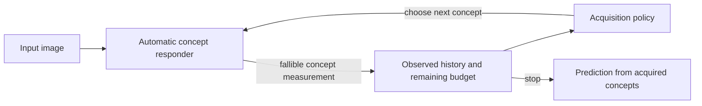

<div align="center">

# CBMJEV

### Adaptive concept acquisition with fallible measurements

**A research project on when a model should ask for another concept—and when it should stop.**


</div>

---

CBMJEV explores a simple question: **if concept measurements can be wrong, can choosing them one at a time improve decisions over predicting every concept at once?** A controller observes the concepts acquired so far, selects the next candidate, receives its measurement, updates its state, and may stop within a query budget.

> **Research status.** This is an actively developed prototype, not a completed benchmark or submission release. The current CUB evidence is development/validation-only and mixed: a local gain over schema order at nominal K=8 does not establish an advantage over stronger fitted-static policies or equal-cost mixtures. No test-set superiority, cross-dataset generalization, or real-world speedup is claimed.

## The idea



The project treats **what was measured** and **what computation was actually performed** as separate questions. A smaller concept mask is not, by itself, evidence of lower inference cost; shared feature extraction and the cost of the responder matter. The code and evaluation notes keep these quantities distinct.

## Repository map

| Path | What it contains |
| --- | --- |
| [`cbmjev/`](cbmjev/) | Core models, policies, responders, and evaluation utilities |
| [`configs/`](configs/) · [`scripts/`](scripts/) | Portable experiment configs and run/analysis entry points |
| [`tests_cbmjev/`](tests_cbmjev/) | Unit and evaluation-protocol tests |
| [`docs/`](docs/) | Data adapters, experiment protocol, scope freeze, and release gates |
| [`research/`](research/) · [`theory/`](theory/) | Literature notes, research decisions, and bounded theoretical analyses |
| [`results/`](results/) | Selected snapshots, explicitly labeled by evidence status |
| [`figures/editable/v4/`](figures/editable/v4/) | Editable PowerPoint figure source and PDF previews |

## Quick start

Requires Python 3.9+ according to the package metadata. From the repository root:

```bash
python -m pip install -e .
python -m unittest discover -s tests_cbmjev -v
```

For experiments, first read the [data adapter guide](docs/DATA_ADAPTERS.md), [experiment guide](docs/EXPERIMENTS.md), and [evaluation protocol](docs/EVALUATION.md). Dataset access, preparation, and compatible PyTorch/CUDA versions are experiment-specific. Set local paths in your own config; never commit credentials or machine-specific paths.

## Reproducibility and responsible use

- Treat exploratory and validation results as development evidence—not test-set results.
- Keep model selection, hyperparameter tuning, and policy design within training/validation splits; reserve test data for a predeclared final evaluation.
- Read the [scope freeze](docs/PROJECT_SCOPE_FREEZE_20260924.md) and [release checklist](docs/RELEASE_CHECKLIST.md) before interpreting results or launching a run.
- The public snapshot intentionally excludes datasets, checkpoints, private server configuration, and unpublished manuscript files. Obtain data through its official access process and follow its license and terms.

## License and citation

No software license or finalized citation metadata is currently declared. **Until a license is added, all rights are reserved; public visibility does not grant permission to reuse, modify, or redistribute this code.** Please do not infer paper authorship or citation details from this repository snapshot.

---

<div align="center">
<sub>CBMJEV · Research prototype · Evidence and claims are intentionally scoped to the artifacts currently available</sub>
</div>
