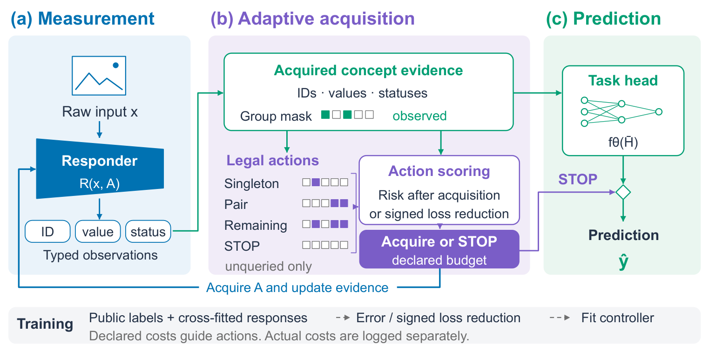

<div align="center">

# CBMJEV

### When Is It Worth Asking?<br>Adaptive Concept Bottlenecks with Fallible Measurements

**Wenshuo Chen · Lujundong Li · Songning Lai**<br>
HKUST(GZ)

[Overview](#overview) · [Quick start](docs/QUICKSTART.md) · [Results](results/README.md) · [Reopened diagnostics](docs/REOPEN_DIAGNOSTICS_20260929.md) · [Editable figures](figures/editable/v5/) · [Citation](#citation)


<a href="LICENSE"></a>

</div>

<p align="center">
  <a href="figures/editable/v5/measurement_boundary_editable.pdf">
    
  </a>
</p>

## Overview

Concept bottleneck models make predictions through interpretable concepts. **CBMJEV asks which concepts to measure next—and when another measurement is no longer worth its cost—when the measurements themselves can be wrong.**

The responder sees the raw input; the task head predicts from acquired concept evidence: identities, values, and observation statuses. The controller uses this evidence and the remaining budget to choose a legal acquisition or `STOP`, then updates its decision when new evidence arrives. Declared query costs guide these choices; actual computation costs are recorded separately.

The paper develops this measurement-aware framework, analyzes when adaptive acquisition can help or fail, and evaluates it against fitted static alternatives. The repository contains the implementation, reproducibility tools, numerical theory checks, development results, and editable paper figures.

## What is in this release?

| Component | Contents |
| --- | --- |
| **Framework** | Typed concept responses, evidence-only policies, grouped acquisition, and explicit stopping |
| **Analysis** | Conditions for evidence-state sufficiency; an equal-cost adaptive advantage construction; estimation, coverage, and stopping bounds, with their assumptions and proofs |
| **Experiments** | CUB development comparisons across four seeds, including fitted static, adaptive value, and BRiG-style references |
| **Reproducibility** | Data adapters, cross-fitting utilities, configs, protocol tests, and machine-readable result summaries |
| **CEBaB controls** | Exploratory fixed-order/empirical-DP, error-transition, DIME-style and LAVOIR-style comparison scripts; no locked-test or method-win claim |
| **Reopened diagnostics** | Predictor-sufficiency, ASAP 18-aspect gold-acquisition, and two-source typed-measurement checks; development evidence without a confirmed method gain |
| **Selective verification (in development)** | Source-only typed readouts, a shared-encoder strong reference, group-OOF fusion, and a one-check-or-STOP evaluator; no new efficacy claim |
| **Figure assets** | Vector PDF figures, previews, and native editable PowerPoint figures |

The full manuscript PDF and LaTeX source are not included in this code release.
A paper link will be added after the authors publish the manuscript.

### Evidence and scope

In the reported CUB development comparisons, the adaptive policies do not improve on the training-fitted static order. At exactly 16 acquired groups, the BRiG-style reference has a mean accuracy difference of **−1.64 percentage points** relative to fitted static over seeds 60–63. The [per-seed diagnostic](results/diagnostics/cub_brig_rle_k16_gate_60_63_v1.json) and [equal-mean-declared-cost comparison](results/main/cub_value_full_grid_equal_mean_cost_static_60_63_v1.json) make the comparisons inspectable.

These are repeatedly inspected **validation results**, not a locked-test evaluation. The constructive theoretical examples establish possibilities under stated assumptions, not empirical gains on CUB. The release does not establish a JEV-specific benefit, cross-dataset efficacy, or a deployment speedup; fewer acquired concepts need not mean less computation.

## Get started

Requires Python 3.9+ and PyTorch 2.2+. Start from a fresh virtual environment and install a PyTorch build compatible with your hardware if using CUDA.

```bash
git clone https://github.com/xll0328/CBMJEV.git
cd CBMJEV
python -m pip install --upgrade pip
python -m pip install -e .
python -m cbmjev doctor --check-device cpu
python -m unittest discover -s tests_cbmjev -v
```

The environment check does not download models or datasets. Follow the [quick-start guide](docs/QUICKSTART.md) for installation, a small runnable example, and the path to reproducing experiments. Obtain datasets separately under their original access conditions; they are not bundled with this repository.

## Repository guide

| Path | Purpose |
| --- | --- |
| [`cbmjev/`](cbmjev/) | Models, acquisition policies, responders, training, and evaluation |
| [`configs/`](configs/) · [`scripts/`](scripts/) | Experiment configurations and run/analysis entry points |
| [`tests_cbmjev/`](tests_cbmjev/) | Unit tests and evaluation-protocol checks |
| [`docs/`](docs/) | Installation, data preparation, and reproducibility guides |
| [`results/`](results/) | Selected development summaries and diagnostics; no datasets or checkpoints |
| [`figures/editable/v5/`](figures/editable/v5/) | Five editable PowerPoint figures, vector PDF exports, and previews |
| [`research/`](research/) · [`theory/`](theory/README.md) | Research notes and numerical checks; historical notes do not replace the current manuscript |

For a new experiment, begin with the [data adapter guide](docs/DATA_ADAPTERS.md) and [evaluation protocol](docs/EVALUATION.md). The [scope freeze](docs/PROJECT_SCOPE_FREEZE_20260924.md) records the bounded empirical study; earlier [experiment plans](docs/EXPERIMENTS.md) include proposed work and are not a list of completed results. Keep dataset paths, credentials, and machine-specific settings out of commits.

The [CEBaB adaptive-controls guide](docs/CEBAB_ADAPTIVE_CONTROLS.md) documents newer exploratory validation comparisons. These scripts do not change the release's evidence boundary: a stronger static comparator can explain the apparent adaptive gain, and no consistent new acquisition-value advantage has been established.

The [reopened diagnostics](docs/REOPEN_DIAGNOSTICS_20260929.md) add the previously missing predictor control, a public 18-aspect gold-concept task, and one real second-source measurement check. They establish branching and limited complementary corrections, but do not establish a robust task-risk/cost advantage. The corresponding code is included without private sample-level traces or manuscript files.

The [selective-verification development guide](docs/SELECTIVE_VERIFICATION.md) documents the next bounded experiment: predict cheap initial concepts, then either stop or verify one with a separately trained source. It includes a same-backbone shared-encoding reference and explicit semantic-repair/damage checks. The code is available for inspection; it is not yet evidence of a new method advantage.

## Citation

If you use the framework, code, or analyses, please cite this repository for now. Machine-readable software metadata is available in [CITATION.cff](CITATION.cff). A manuscript link can be added if the authors publish one; no arXiv identifier is assigned here.

```bibtex
@misc{chen2026cbmjev,
  title  = {{CBMJEV}: When Is It Worth Asking? Adaptive Concept Bottlenecks
            with Fallible Measurements},
  author = {Chen, Wenshuo and Li, Lujundong and Lai, Songning},
  year   = {2026},
  url    = {https://github.com/xll0328/CBMJEV},
  note   = {Research code repository; manuscript not distributed here}
}
```

## License

The project code is released under the [MIT License](LICENSE). The manuscript, figures, and third-party assets are not relicensed by that code license. See [third-party notices](THIRD_PARTY_NOTICES.md) for the scope and acknowledgments; datasets, model weights, and dependencies retain their original terms.
