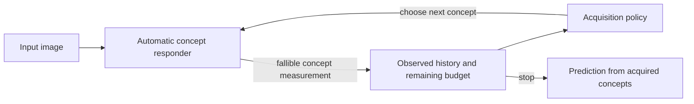

<div align="center">

# CBMJEV

### Adaptive concept acquisition with fallible measurements

**A research project on when a model should ask for another concept—and when it should stop.**


</div>

---

CBMJEV explores a simple question: **if concept measurements can be wrong, can choosing them one at a time improve decisions over predicting every concept at once?** A controller observes the concepts acquired so far, selects the next candidate, receives its measurement, updates its state, and may stop within a query budget.

> **Research status (28 September 2026).** This is a development-stage research prototype, not a positive method result or a completed benchmark release. The four-seed CUB comparisons show a local gain over schema order at nominal K=8, but not over a training-fitted static order or the retrospective equal-mean-cost static reference. An exact-K16 BRiG-style sequential reference also trails fitted static in all four evaluated seeds. These are repeatedly inspected validation results, not locked-test evidence. No JEV-specific benefit, cross-dataset efficacy, or deployment speedup is claimed.

## The idea


```mermaid
flowchart LR
    X[Input image] --> R[Automatic concept responder]
    H[Observed history and remaining budget] --> P[Acquisition policy]
    P -->|choose next concept| R
    R -->|fallible concept measurement| H
    H -->|stop| C[Prediction from acquired concepts]
```

The project treats **what was measured** and **what computation was actually performed** as separate questions. A smaller concept mask is not, by itself, evidence of lower inference cost; shared feature extraction and the cost of the responder matter. The code and evaluation notes keep these quantities distinct.

## Repository map

| Path | What it contains |
| --- | --- |
| [`cbmjev/`](cbmjev/) | Core models, policies, responders, and evaluation utilities |
| [`configs/`](configs/) · [`scripts/`](scripts/) | Portable experiment configs and run/analysis entry points |
| [`tests_cbmjev/`](tests_cbmjev/) | Unit and evaluation-protocol tests |
| [`docs/`](docs/) | Data adapters, experiment protocol, scope freeze, and release gates |
| [`research/`](research/) · [`theory/`](theory/) | Literature notes, research decisions, and bounded theoretical analyses |
| [`results/`](results/) | Selected validation-only aggregates and diagnostic snapshots; no raw datasets or checkpoints |
| [`figures/editable/v4/`](figures/editable/v4/) | Editable PowerPoint figure source and PDF previews |

## Current evidence, without a positive-result spin

On CUB-200-2011, the adaptive value policies exceed a non-learned schema order at the nominal eight-group cap, yet remain below the stronger order fitted on training-only data. Across the examined equal-mean-declared-cost budgets, neither value policy has a positive four-seed mean accuracy difference from a retrospective static-prefix mixture. The exact-16-group BRiG-style reference has a mean accuracy difference of **−1.64 percentage points** and macro-F1 difference of **−1.44 points** against fitted static; all four accuracy differences are negative. The [machine-readable K16 diagnostic](results/diagnostics/cub_brig_rle_k16_gate_60_63_v1.json) and [equal-cost grid](results/main/cub_value_full_grid_equal_mean_cost_static_60_63_v1.json) are provided for inspection. These comparisons are descriptive and development-scoped; they do not show general inferiority of adaptive acquisition.

The manuscript is being prepared as a bounded study of when sequential concept measurement is *not* yet justified. Its author list is pending confirmation, so the paper source/PDF is intentionally not published in this repository or submitted to arXiv yet.

## Quick start

Requires Python 3.9+ according to the package metadata. From the repository root:

```bash
python -m pip install -e .
python -m unittest discover -s tests_cbmjev -v
```

For experiments, first read the [data adapter guide](docs/DATA_ADAPTERS.md), [experiment guide](docs/EXPERIMENTS.md), and [evaluation protocol](docs/EVALUATION.md). Dataset access, preparation, and compatible PyTorch/CUDA versions are experiment-specific. Set local paths in your own config; never commit credentials or machine-specific paths.

## Reproducibility and responsible use

- Treat exploratory and validation results as development evidence—not test-set results.
- Keep model selection, hyperparameter tuning, and policy design within training/validation splits; reserve test data for a predeclared final evaluation.
- Read the [scope freeze](docs/PROJECT_SCOPE_FREEZE_20260924.md) and [release checklist](docs/RELEASE_CHECKLIST.md) before interpreting results or launching a run.
- The public snapshot intentionally excludes datasets, checkpoints, private server configuration, and unpublished manuscript files. Obtain data through its official access process and follow its license and terms.

## License and citation

No software license or finalized citation metadata is currently declared. **Until a license is added, all rights are reserved; public visibility does not grant permission to reuse, modify, or redistribute this code.** Please do not infer paper authorship or citation details from this repository snapshot.

---

<div align="center">
<sub>CBMJEV · Research prototype · Evidence and claims are intentionally scoped to the artifacts currently available</sub>
</div>
